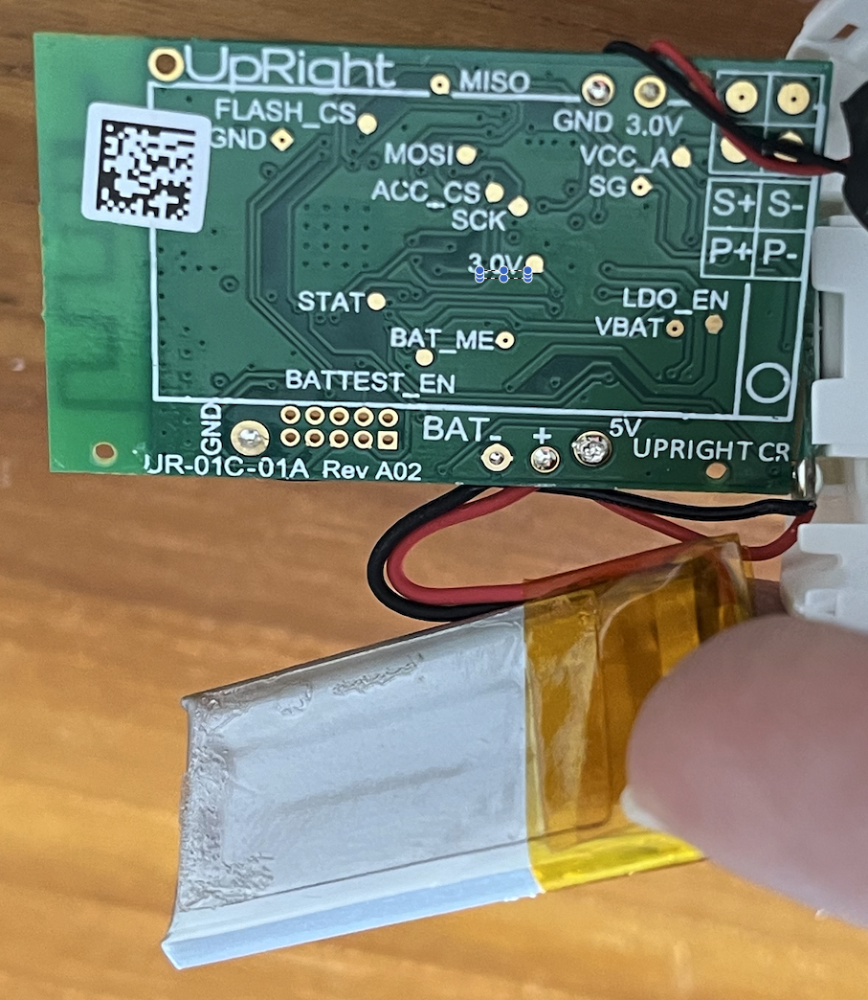

## Reverse Engineering: Upright GO V.1

This project aims to reverse engineer the Upright GO V.1 posture corrector device for learning and to enable the creation of an open-source alternative to the official (discontinued) mobile application.


**Status**: Work in Progress
The project is currently on hold due to **apparently** a firmware corruption on the device I was using. It seems that the device allows firmware updates without checking the integrity of the firmware, which can lead to a bricked device - and I believe that's what happened to mine while I was too excited to test all `write` characteristics by pushing `\x1`. :innocent: I'm currently looking for a way to recover the device (or get a new one), but I'm not sure if it's possible. If you have any suggestions, please let me know!

### Table of Contents

- [Introduction](#introduction)
- [Hardware](#hardware)
  - [CC2540](#cc2540)
  - [BLE](#ble)
    - [Characteristics Table: WIP](#characteristics-table-wip)
- [Teardown](#teardown)
  - [Front](#front)
  - [Back](#back)
- [TODO](#todo)
  - [Minor](#minor)
- [Credits](#credits)
- [Disclaimer](#disclaimer)
- [Acknowledgements](#acknowledgements)

## Introduction

The Upright GO is a posture corrector device that is worn on the upper back. It is designed to help users improve their posture by vibrating when the user slouches. The device is connected to a mobile application that provides feedback on the user's posture. The Upright GO V.1 is the first version of the device, and it has been discontinued in favor of the Upright GO V.2.

Ever since the Upright GO V.1 was discontinued, the mobile application has stopped working. While the device is still [usable without the
app](https://help.uprightpose.com/en/articles/1864288-using-your-upright-go-without-the-app), there's no workaround to provide users with historical data and feedback on their posture. This project aims to reverse engineer the Upright GO V.1 to

- Study and document the communication protocol between the Upright GO V.1 and the mobile application.
- Create some open-source alternatives to the official mobile application.

### History

- The Upright GO was first crowdfunded on Kickstarter in 2014, being first delivered to backers in mid-2016.
- Somewhere in 2018, the Upright GO V.1 was discontinued in favor of the Upright GO V.2, which has a slightly different design and features.

## Hardware

> **Disclaimer**: This section, like the others, is primarily based on my personal experimentation with the device and research from various online sources. As a result, it may not be entirely accurate. If you have any corrections or suggestions, your input is welcome!

The Upright GO V.1 is built on top of the [Texas Instruments CC2540 Bluetooth Low Energy (BLE) System-on-Chip (SoC)](https://www.ti.com/product/CC2540). The device is powered by a 3.7V 115mAh LiPo battery, a 3-axis accelerometer to detect the user's posture, and a vibration motor to provide feedback to the user. For charging, the device provides a Micro-USB port, this port is used exclusively for charging the device and does not provide any data connectivity.

### CC2540

The CC2540 SoC allows engineers to create a custom BLE profile used to communicate with other devices. The BLE profile is a set of rules that defines how the device and the mobile application communicate with each other.

The flashing of the CC2540 is done (frequently) using the [TI CC Debugger](https://www.ti.com/tool/CC-DEBUGGER) and the [SmartRF Flash Programmer](https://www.ti.com/tool/FLASH-PROGRAMMER) software.

The CC2540 SoC is programmed using the [Texas Instruments IAR Embedded Workbench](https://www.iar.com/iar-embedded-workbench/), which is a ~~prohibitly expensive~~ commercial IDE that is used to develop and debug embedded applications.

More details on the CC2540 can be found in the [CC2540 Datasheet](https://www.ti.com/lit/ds/symlink/cc2540.pdf).

### BLE

The BLE communication between the Upright GO V.1 and the mobile application is done using the [Generic Attribute Profile (GATT)](https://www.bluetooth.com/specifications/gatt/). The GATT profile is a hierarchical data structure and a standardized set of services and characteristics
that defines how the BLE device will communicate.

Each GATT service has a unique 128-bit UUID that is used to identify the service. These GATT services are then divided into **characteristics**, which are used to exchange data between the device and the mobile application.

**Characteristics** are the "data" level of the hierarchy are the key to understand how BLE devices work in general, and thus we can use to reverse engineer the Upright GO V.1 and try to mimic the actions present in the official mobile application. For the sake of completeness, here's a brief overview of what can be done with characteristics:

- **Read**: The characteristic can be read by the client.
- **Write**: The characteristic can be written by the client.
- **Notify**: The characteristic can notify the client when the value changes.

> The Characteristics 128-bit UUIDs are composed according to the following format: `0000XXXX-0000-1000-8000-00805f9b34fb`, where `XXXX` is the 16-bit UUID of the characteristic and `0000-1000-8000-00805f9b34fb` is BLE's standard base UUID.

So, characteristics can be understood similarly to what an endpoint is to a web API, where you can read, write, and subscribe to changes in the data (as a webhook or a WebSocket). We can use the characteristics to read and write data to the device.

#### Characteristics Table: WIP (Work in Progress)

During my exploration of the device, these are some of the key characteristics that I have identified so far (I used Python's [`bleak`](https://github.com/hbldh/bleak) library to interact with the device):

| UUID   | Type        | Description                                                                                                                                                                                                                                        |
| ------ | ----------- | -------------------------------------------------------------------------------------------------------------------------------------------------------------------------------------------------------------------------------------------------- |
| `aad3` | Write       | Sends `\x1` to calibrate the device; Same as pressing the device's button twice or tapping "Calibrate" on the app.                                                                                                                                 |
| `aab3` | Read        | Reads a 4-byte sequence that likely represents an angle and some additional data (maybe also gyroscope associated), with an integer in front of them. Ex. `bytearray(b'\x00\x9A\x01\x12')` or `[0, 154, 1, 18]`:                                   |
| `aaca` | Notify/Read | Reads values seem to provide the current angle of the device, followed by some sort of internal status. **Apparently** the final bytes id `\x02` when the device is considered in a slouched position. Ex.: `bytearray(b'\xe1\x01')` or `[225, 1]` |
| `aad3` | Write       | If True `\x1` start the vibration on the device; If False `\x0` pauses the vibration. Note: NOT associated with the device's position.                                                                                                             |
| `aad4` | Write       | If True `\x1` turn on the RED led on the device; If False `\x0` turn off the LED.                                                                                                                                                                  |
| `aad5` | Write       | If True `\x1` turn on the BLUE led on the device; If False `\x0` turn off the LED.                                                                                                                                                                 |
| `aac6` | Notify/Read | Reads a toggled value between `\x1` or `\x0` if the button on the device is pressed.                                                                                                                                                               |

> **Note**: The characteristics table is a work in progress and sould be re-organized by GATT Service. It will be updated as I continue to explore the device. Unfortunately, I was way too excited to explore as much as possible and didn't take notes of the characteristics I've found. Nonetheless, `aad3` and `aaca` are the most important ones to interact with the device and be able to gather data from it.

## Sample Code

Here's a simple Python script that uses the `bleak` library to interact with the Upright GO V.1 device. This script continuosly reads the current angle of the device and prints it to the console. Check the [code-samples](code-samples) directory for more details.

```python
import asyncio
from bleak import BleakClient

async def main():
    address = "xxxxxxxx-xxxx-xxxx-xxxx-xxxxxxxxxxxx"
    characteristic_uuid = "0000aac6-0000-1000-8000-00805f9b34fb"

    def notification_handler(sender, data):
      print(f"Notification from {sender}: {data}")

    async with BleakClient(address) as client:
      await client.start_notify(characteristic_uuid, notification_handler)

      print(f"Subscribed to notifications from {characteristic_uuid}")

      await asyncio.sleep(3000)

      await client.stop_notify(characteristic_uuid)

if __name__ == "__main__":
    asyncio.run(main())
```

## Teardown

### Front


### Back



## TODO

All of the following tasks are subject to change as I continue to explore the device and **are not in any particular order**. By the way, feel free to suggest new tasks, improvements, or contribute.

## Major

- [x] Write the first draft of the README.
- [ ] Create a more detailed characteristics table. (WIP)
- [ ] Create a minimalistic Python library to interact with the device from a computer.
- [ ] Create a mobile application to interact with the device. Maybe using Flutter or React Native to make it cross-platform.

### Minor

- [ ] Identify the location of the accelerometer on the device. (I was not able to find it during the teardown due to my awful sight)

## Contributing

If you would like to contribute to this project, please feel free to open an issue or a pull request. I would be happy to collaborate with you!

This project is meant to be free and acessible, all contributions are welcome and will be credited. 

## Credits

This project was created by [Nilton Heck](https://www.linkedin.com/in/niltonheck/) and is licensed under the MIT License.

## Disclaimer

This project is not affiliated with Upright GO, Texas Instruments, or any other company. The information provided here is for educational purposes only and should not be used for any commercial purposes.

Even though I encourage the use of this information to create some open-source alternatives to the official mobile application, I do not condone the use of this information to create counterfeit devices or to infringe on any intellectual property rights. Please respect the rights of the original creators.

## Acknowledgements

- [Upright GO](https://www.uprightpose.com/)
- [Texas Instruments](https://www.ti.com/)
- [Bluetooth SIG](https://www.bluetooth.com/)
- [IAR Systems](https://www.iar.com/)
- [CC Debugger](https://www.ti.com/tool/CC-DEBUGGER)
